<table>
  <tbody>
    <tr>
      <td>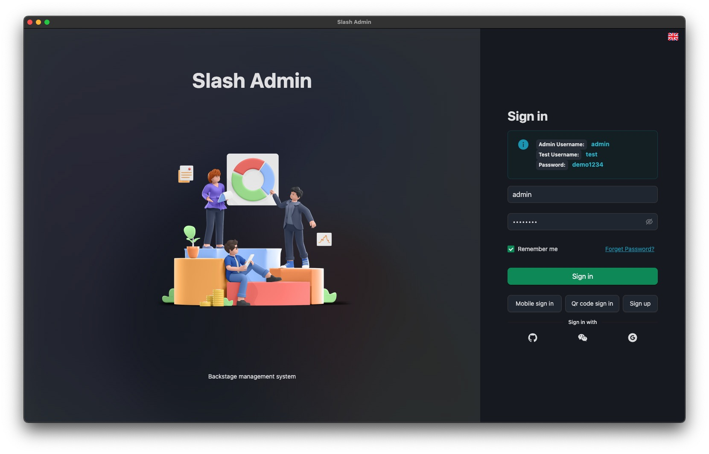</td>
      <td>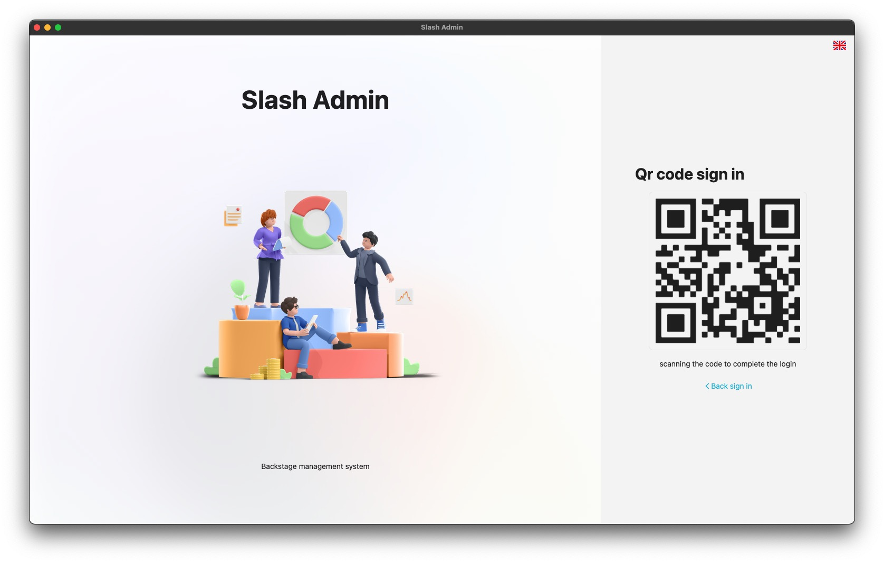</td>
    </tr>
    <tr>
      <td>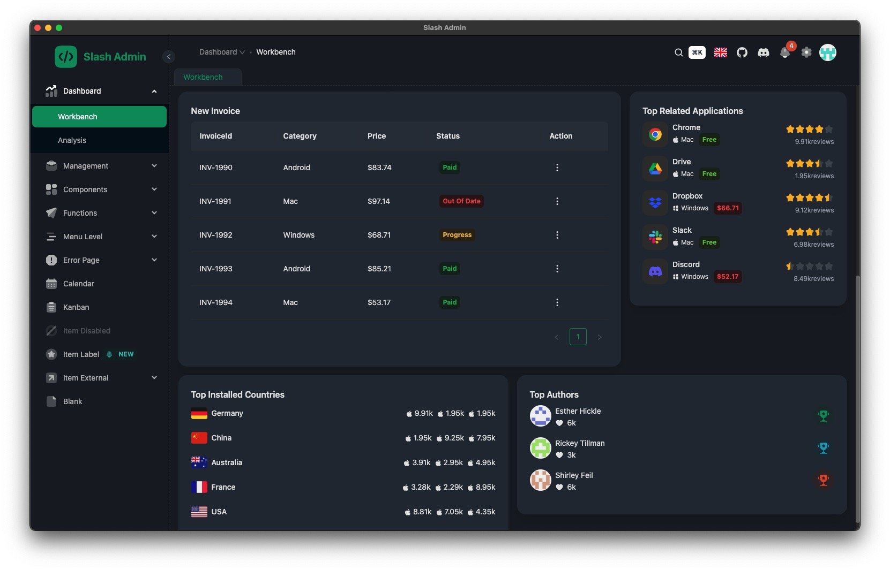</td>
      <td>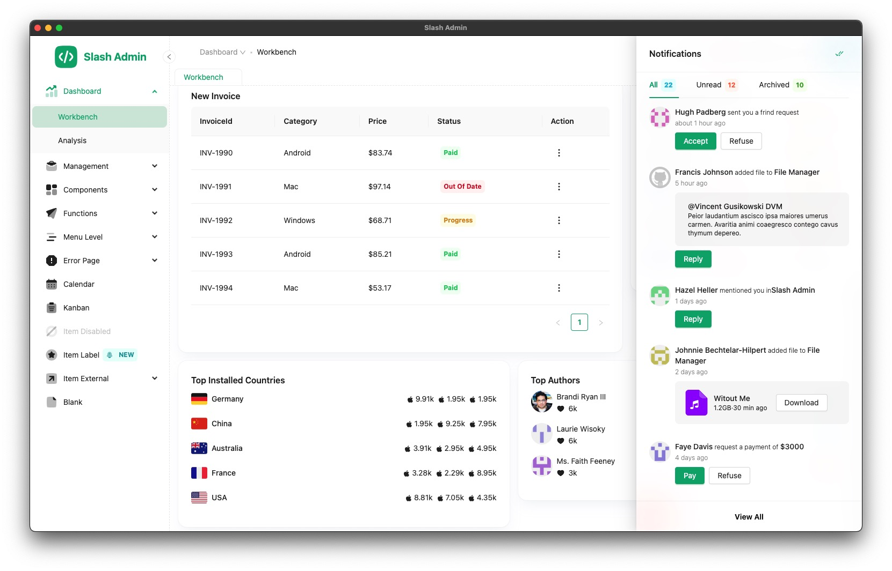</td>
    </tr>
    <tr>
      <td>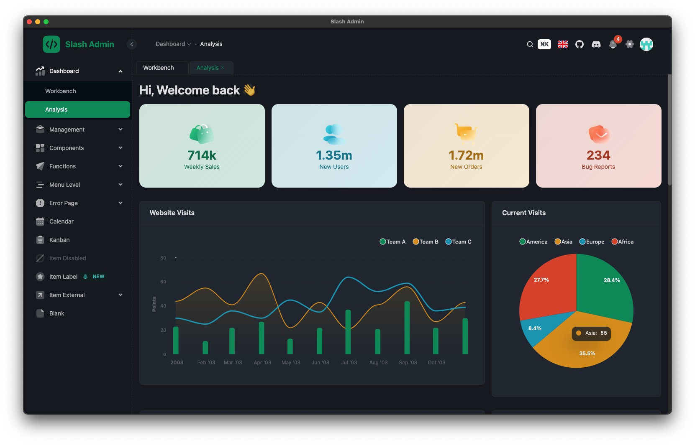</td>
      <td></td>
    </tr>
    <tr>
      <td></td>
      <td>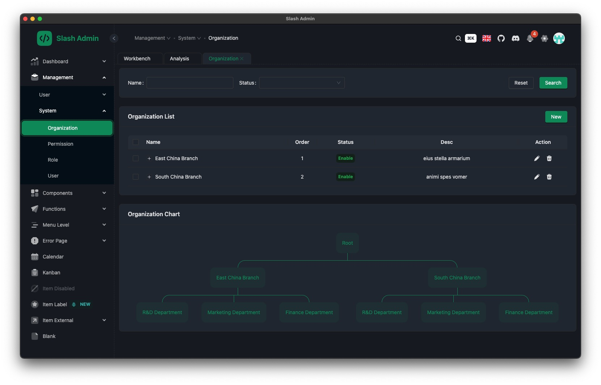</td>
    </tr>
    <tr>
      <td>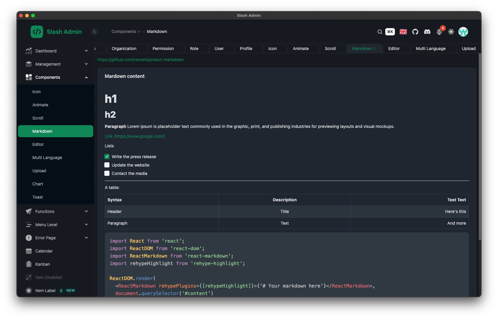</td>
      <td>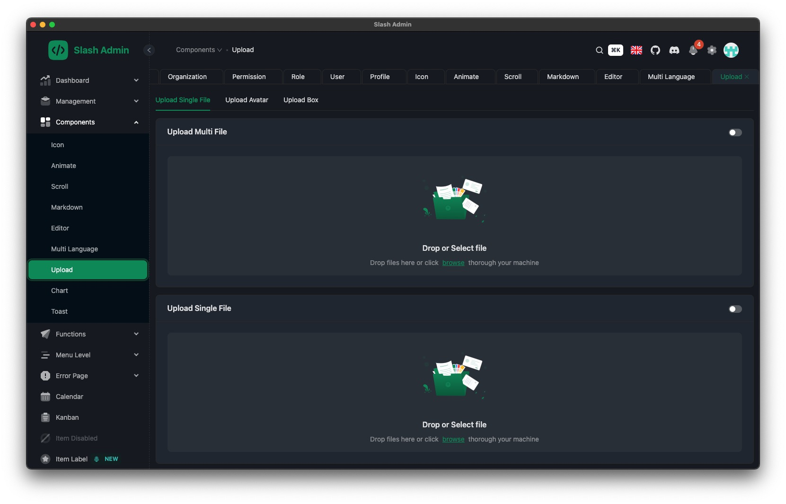</td>
    </tr>
    <tr>
      <td>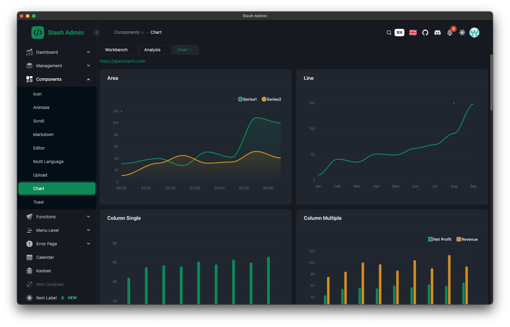</td>
      <td></td>
    </tr>
    <tr>
      <td>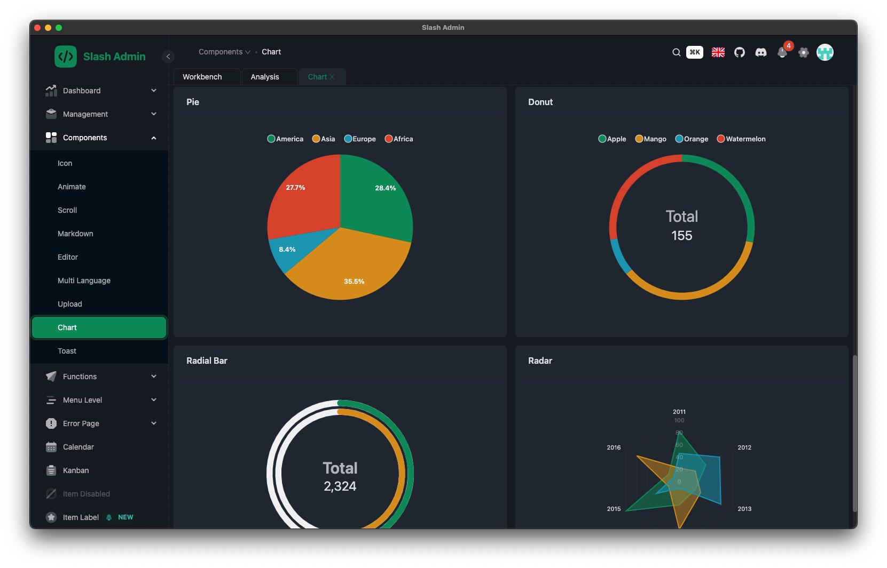</td>
      <td>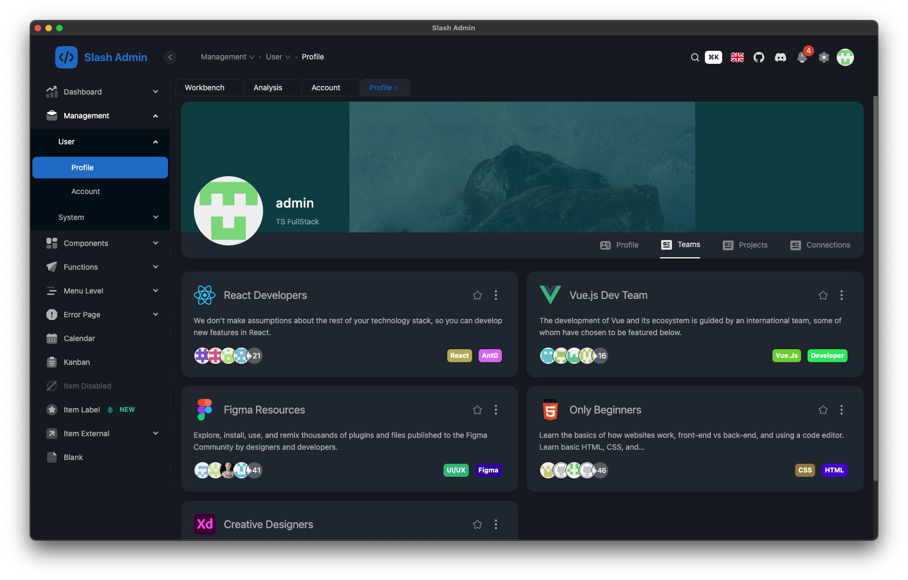</td>
    </tr>
    <tr>
      <td></td>
      <td>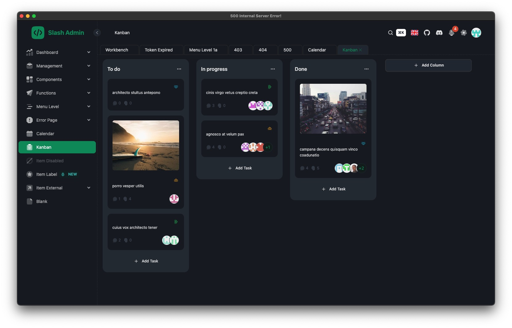</td>
    </tr>
  </tbody>
</table>

<br/>

# electron-slash-admin

An electron boilerplate base on:
1. [electron-vite-react](https://github.com/electron-vite/electron-vite-react) 
2. [slash-admin](https://github.com/d3george/slash-admin)

<hr/>
<br/>

[](https://github.com/vitejs/awesome-vite)


[](https://nodejs.org/about/releases)

English | [简体中文](README.zh-CN.md)

## 👀 Overview

📦 Ready out of the box  
🎯 Based on the official [template-react-ts](https://github.com/vitejs/vite/tree/main/packages/create-vite/template-react-ts), project structure will be familiar to you  
🌱 Easily extendable and customizable  
💪 Supports Node.js API in the renderer process  
🔩 Supports C/C++ native addons  
🐞 Debugger configuration included  
🖥 Easy to implement multiple windows  

## ⌨️ Dependencies

```json
"react":              "^18.3.1",
"react-dom":          "^18.3.1",
"react-router-dom":   "^6.16.0",
"electron":           "^33.2.0",
"electron-updater":   "^6.3.9",
"vite":               "^5.4.11",
"msw":                "^2.4.9",
"antd":               "^5.9.3",
"apexcharts":         ">=4.0.0",
```

## 🛫 Quick Setup

```sh
# clone the project
git clone https://github.com/12343954/electron-slash-admin.git

# enter the project directory
cd electron-slash-admin

# install dependency
npm install

# develop
npm run dev
```

## 🐞 Debug


## 📂 Directory structure

Familiar React application structure, just with `electron` folder on the top :wink:  
*Files in this folder will be separated from your React application and built into `dist-electron`*  

```tree
├── electron                                 Electron-related code
│   ├── main                                 Main-process source code
│   └── preload                              Preload-scripts source code
│
├── release                                  Generated after production build, contains executables
│   └── {version}
│       ├── {os}-{os_arch}                   Contains unpacked application executable
│       └── {app_name}_{version}.{ext}       Installer for the application
│
├── public                                   Static assets
└── src                                      Renderer source code, your React application
```

<!--
## 🚨 Be aware

This template integrates Node.js API to the renderer process by default. If you want to follow **Electron Security Concerns** you might want to disable this feature. You will have to expose needed API by yourself.  

To get started, remove the option as shown below. This will [modify the Vite configuration and disable this feature](https://github.com/electron-vite/vite-plugin-electron-renderer#config-presets-opinionated).

```diff
# vite.config.ts

export default {
  plugins: [
    ...
-   // Use Node.js API in the Renderer-process
-   renderer({
-     nodeIntegration: true,
-   }),
    ...
  ],
}
```
-->

## 🔧 Additional features

1. electron-updater 👉 [see docs](src/components/update/README.md)
1. playwright

## ❔ FAQ

- [C/C++ addons, Node.js modules - Pre-Bundling](https://github.com/electron-vite/vite-plugin-electron-renderer#dependency-pre-bundling)
- [dependencies vs devDependencies](https://github.com/electron-vite/vite-plugin-electron-renderer#dependencies-vs-devdependencies)

## ☕️ Sponsor

